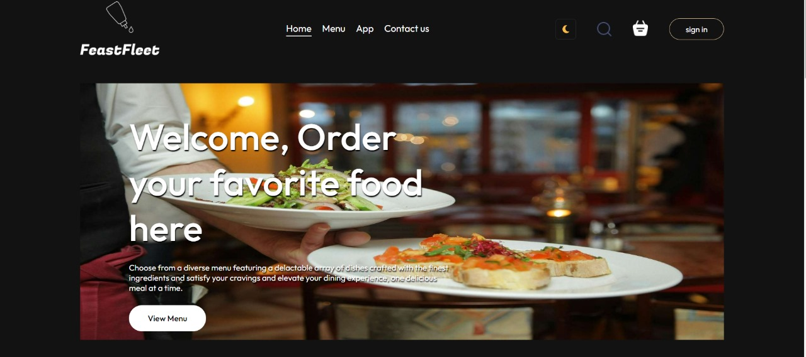
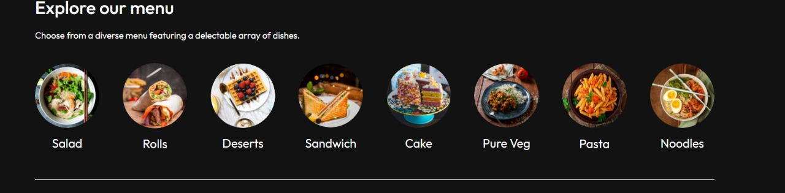
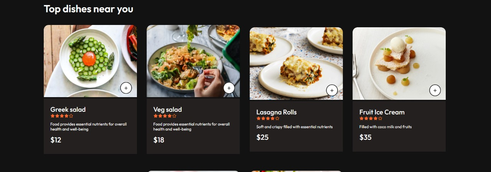
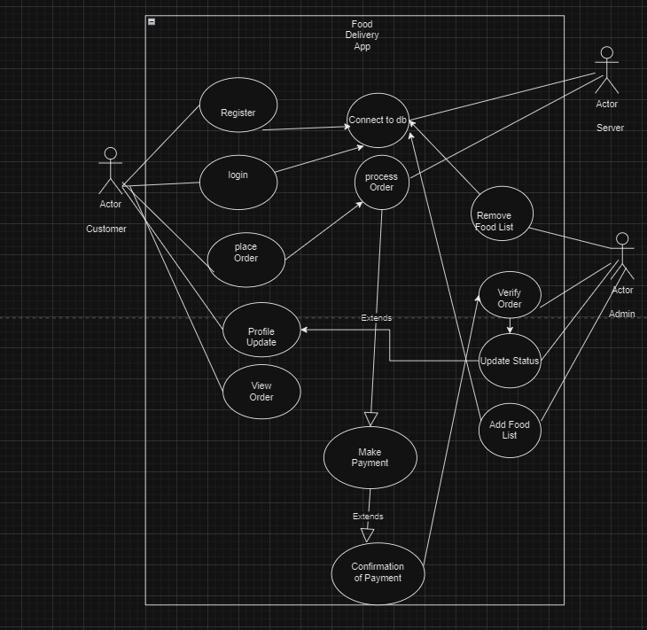

# 🍽️ Food Ordering System

Welcome to the **Food Ordering System**, a full-stack web application designed to facilitate online food ordering with seamless management for both customers and administrators. This project integrates an intuitive UI for customers, a powerful backend for order management, and an admin panel for managing food items and processing orders. 

## 📋 Table of Contents
1. [Overview](#-overview)
2. [Features](#-features)
3. [Tech Stack](#-tech-stack)
4. [Installation](#-installation)
5. [Usage](#-usage)
6. [API Endpoints](#-api-endpoints)
7. [Screenshots](#-screenshots)
8. [Folder Structure](#-folder-structure)
9. [Contributing](#-contributing)
10. [License](#-license)
11. [Contact](#-contact)

## 🌟 Overview

The **Food Ordering System** is a web-based application where customers can:
- Register and log in to their accounts.
- Browse a variety of food categories.
- Add items to their cart and place orders.
- Track the status of their orders.

Administrators have full control to:
- Add, edit, and remove food items.
- Manage customer orders and update statuses.
- View order details and customer information.

## ✨ Features

### For Customers:
- **User Authentication**: Secure registration and login using JWT.
- **Order Food**: Browse available food items and place orders.
- **Order Tracking**: Track the order status from preparation to delivery.
- **User Profile**: Update personal information.

### For Admins:
- **Food Management**: Add, edit, and delete food items.
- **Order Management**: View all orders, update order statuses.
- **Customer Management**: View customer information and order history.

### General:
- **Payment Integration**: Easily make payments for food orders.
- **Responsive Design**: Works seamlessly on desktop and mobile devices.
- **Real-time Updates**: Track order statuses in real-time.

## 🛠️ Tech Stack

### Frontend:
- **React** with hooks for dynamic rendering.
- **Axios** for HTTP requests.
- **React Router** for client-side navigation.
- **Bootstrap** and custom CSS for responsive design.
- **React Toastify** for user notifications.

### Backend:
- **Node.js** with Express for server-side logic.
- **MongoDB** with Mongoose for the database.
- **JWT** for secure authentication.
- **Multer** for file handling (images).
- **Bcrypt** for password hashing.

### Tools & Libraries:
- **Axios**: For API requests.
- **Toastify**: For notifications.
- **FormData**: To handle image uploads.
- **dotenv**: For environment variables.

## 📦 Installation

### Prerequisites:
- Node.js (v14+)
- MongoDB (local or cloud)
- Git

### Steps:
1. **Clone the repository**:
   ```bash
   git clone https://github.com/ayu-ano/fleetfeast.git
   ```

2. **Navigate to the project folder**:
<<<<<<< HEAD
 *Frontend*
   ```bash
   cd frontend
   ```
   *Backend*
     ```bash
   cd backend
   ```
   *Admin*
     ```bash
   cd admin
   ```

3. **Install dependencies**:
###### for frontend
   ```bash
   npm install
   ```
   
```bash
      npm install react-router-dom
   ```
###### for admin
 ```bash
   npm install
   ```
###### for backend
```bash
   npm install express mongoose bcrypt validator jsonwebtoken nodemon cors dotenv body-parser multer stripe 
   ```

4.**Set up environment variables: .env file**:
```bash
MONGO_URI=<your-mongodb-uri>
JWT_SECRET=<your-jwt-secret>
PORT=5000
STRIPE_SECRET_KEY=<your-stripe-secret-key>
```

5.**Start the server (backend):** use any one command
```bash
 npm run server
 npm server.js
 nodemon server.js
```

6.  ##  🚀Usage

### Running the Project

#### Development Mode:
- **Backend**: `npm run dev`
- **Frontend**: `npm start` in the `frontend` directory.

#### Production Mode:
- **Build frontend**: `npm run build` in the `frontend` directory.
- **Serve**: `npm start`

7. ##  Testing

- Unit tests can be added using **Jest** or **Mocha**.
- Lint the code using **ESLint**:

```bash
  npm run lint
```


8. ## 📡 API Endpoints

### User Routes:
- **POST** `/api/user/register` - Register a new user.
- **POST** `/api/user/login` - Login a user.

### Order Routes:
- **POST** `/api/order/place` - Place a new order.
- **POST** `/api/order/verify` - Verify order payment.
- **POST** `/api/order/userorders` - Retrieve user-specific orders.
- **GET** `/api/order/list` - List all orders for admin.
- **POST** `/api/order/status` - Update order status.

### Food Routes:
- **POST** `/api/food/add` - Add a new food item.
- **GET** `/api/food/list` - Retrieve all food items.
- **POST** `/api/food/remove` - Remove a food item.


9. ## 📸 Screenshots

-  **Home Page**
   
   
   

- **Use case Diagram**


- **Admin Panel**
   

- **Order Tracking**
   

-  **Payment Page**
   


10. ## 📄 Documentation

For more detailed information, please refer to the [User Guide](./soft-doc/Software_Engineering_Project_Report.pdf).


=======
   ```bash
   cd frontend
   ```

3. **Install dependencies**:
   ```bash
   
   ```
>>>>>>> 188637bc41e19b33d1d825452997c95572906159
